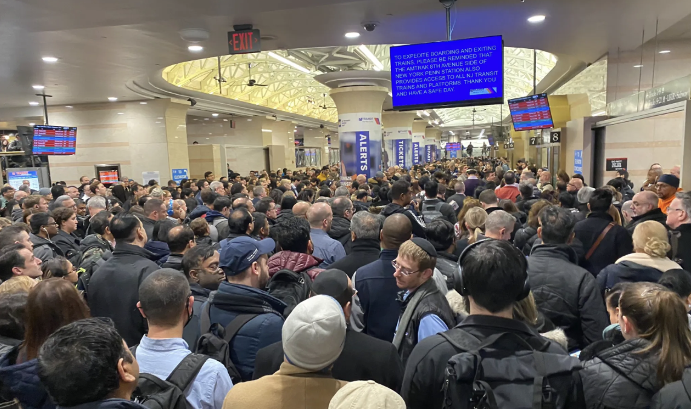
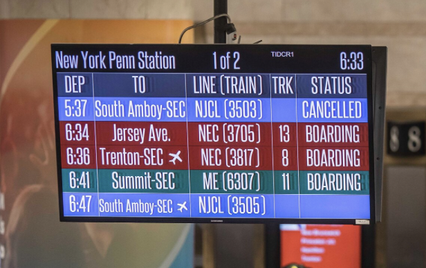

# TRACK CHIEF - TRACK PREDICTOR APP FOR NJ TRANSIT

  

<h1>**(WIP)** </h1>
<b>Real-time track predictor for NJ Transit commuter trains @ NY Penn Station -> future web/mobile app</b>

<h2>The Problem</h2>

If you've ever commuted to and from New York Penn Station using NJ Transit, you'll know what I'm talking about.  
<i>They call it the pit, the rush, the meat grinder...</i> 
  
  

<em align = "center">NJ Transit main concourse in NY Penn Station</em>
 
 
Essentially, NJ Transit commuter trains departing from NY Penn Station <b>do not announce the track until about 10 minutes prior</b> to scheduled departure. Imagine you're waiting in the main concourse for the scheduled 6:36 PM Northeast Corridor Line (NEC) train bound for Trenton. Suddenly, the track number pops up on the departure screen, and it's a mad rush to get to the platform first, so that you can secure your seat on the busy train.  

<em align = "center">The scene looks something like this</em>

 

<h2> Plan & Workflow</h2>

- Develop a full-stack mobile-friendly application (React Native) for commuters that predicts the track number of scheduled departing NJ Transit trains from New York Penn Station with at least 80% accuracy, allowing users to enter trains over 10 minutes before track is announced.  
- Utilize NJ Transit’s GTFS data to retrieve train schedule info while also creating a containerized (K8s) web scraping API that
fetches track numbers, storing data collected in an Google Cloud SQL relational database which integrates with Django backend.  
- Incorporate Tensorflow to handle historical track data to create a logistic regression-based ML model and continuously 
improve predictions as data is collected over time.  

  

